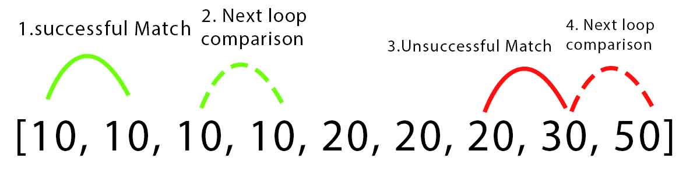

# BioScout Technical Challenge

To view my code running visit [my deployed React UI on Github Pages](https://nicolmmm.github.io/technical-challenge/). Open the browser terminal to see the test outputs.

In this repo, the solution to the first problem, Pairing Spores, can be found in the PairSpore.js file. The solution for the second problem, Fibonacci Sequence, can be found in the Fibo.js file.

## Pairing Spores

For this question I tried several unsuccessful strategies before arriving at my final solution.

My initial instinct was to implement nested loops to compare each item in the array to every other item in the array, when the items match, to increment the sporePairs count. I soon realised that values would match multiple times. Every solution I thought of to account for this created more nested loops, like pushing outer loop items to a new array and comparing all inner loop items to this array to ensure no double ups. I abandoned this strategy before arriving at a working solution.

Writing in pseudo code, the next strategy was:

- Using a while-loop, loop through the given array and filter out all values matching index[0]
- then numberOfMatches=(originalArray.length- filteredArray.length)
  If the matches was an odd number, -1, then / 2 to find the number of pairs.
- Repeat for every value until there are no items left in the array causing the while loop to finish.

Implementing this because very long and disconcerted and I also abandoned this before I reached a working solution.

### Solution

Finally I reached a concise solution:

```
function PairSpores(sporeArray) {
let sporePairCount = 0;
const copiedArray = [...sporeArray];
copiedArray.sort();
for (let index = 0; index < sporeArray.length; index++) {
if (copiedArray[index] === copiedArray[index + 1]) {
index++;
sporePairCount++;
}
}
return sporePairCount;

sporePairCount=sporePairCount
}

```

This solution relies on a single loop. It sorts the array by item value, comparing items next to one another `(copiedArray[index] and copiedArray[index+1])`. Each time the loop runs, if a match is not found it index increments by 1 comparing the next item in the array to the previous item. If a match is found, the sporePairCount increments by 1 and index increments by 2, so not to compare a value that has already been matched in a pair.



## Fibonacci sequence

Since every number in the fibonacci sequence is the sum of the 2 previous numbers, it was a very satisfying solution to implement.

```
function Fibo(n) {
if (n === 0) {
return 0;
}
if (n === 1) {
    return 1;
  } else {
let a = 0;
let b = 1;
let c;
for (let index = 1; index < n; index++) {
c = a + b;
a = b;
b = c;
}

return c;
}
}


```

Using a for-loop, I set the loop exit condition to the `n` argument, the position of the sequence I want to find the value of.

```
for (let index = 1; index < n; index++){
```

The loop will recursively find the next numbers of the sequence by adding the previous 2. Each time the loop runs `c` if given the value of sum of `a` and `b`, `a` is given the value of `b` and `b` is given the value of `c`. In my implementation I have handle cases for n=0 or n=1 with `if` statements because in these cases they will not meet the condition for the for-loop to run in the first place.
